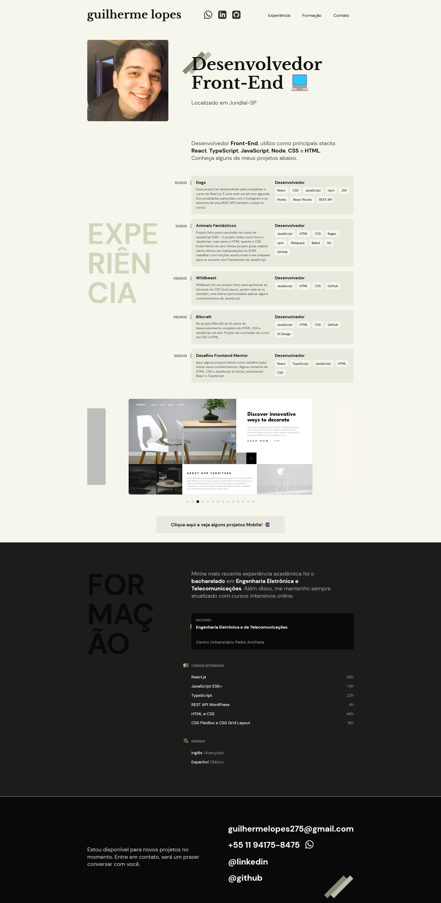

# Portfolio

> Portfolio pessoal com descrição de projetos e experiências

### Ajustes e melhorias

Projeto em andamento, veja abaixo:

- [x] Desenvolvimento em HTML, CSS e JavaScript Vanilla
- [x] Implementação responsiva
- [x] Criação de slides e stories para mostrar projetos de maneira mais visual
- [ ] Desenvolvimento de um botão de tradução para Inglês

## 💻 Pré-requisitos

Antes de começar, verifique se você atendeu aos seguintes requisitos:

* Você instalou a versão mais recente de `Node.js`

## 🚀 Instalando Portfolio

Para instalar o Portfolio, siga estas etapas:

* Clone esse repositório com `git clone https://github.com/gguilhermelopes/gguilhermelopes.github.io`
* Entre na pasta com `cd gguilhermelopes.github.io`
* Utilze uma extensão como a Live Server do VSCode em sua IDE para melhor visualização do site localmente

## ☕ Usando Portfolio

Para usar Portfolio, siga estas etapas:

* Abra o seu Live Server!
